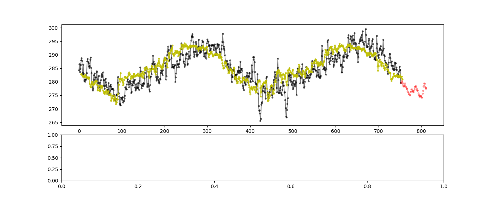

# Time series forecasting

### Time series forecasting

  * lstm (Long Short Term Memory) 

  * ets (Exponential smoothing state space)

  * stl (Seasonal and Trend decomposition using Loess)

  * prophet
  
  * Decision tree regressor

### Configuration 	
~~~~
Input data: 
ts_df            # dataframe['timestamp', 'kpivalue']
ts_sample_frequency = '60min'  # resample time window

Training data:
ts_df_scaler                  # scaler of kpivalue
ts_features = ['hourly', 'weekly', ...]  # using time feature for training
train_size_rate = 0.7       # split training and testing data
~~~~

### Project

set 'lstm-time-series' as working directory

  * In Pycharm

in pycharm > file > setting > console > working directory )

  * In python script

`
import os

os.chdir("C:\\...\\lstm-time-series")

print(os.getcwd())
`
